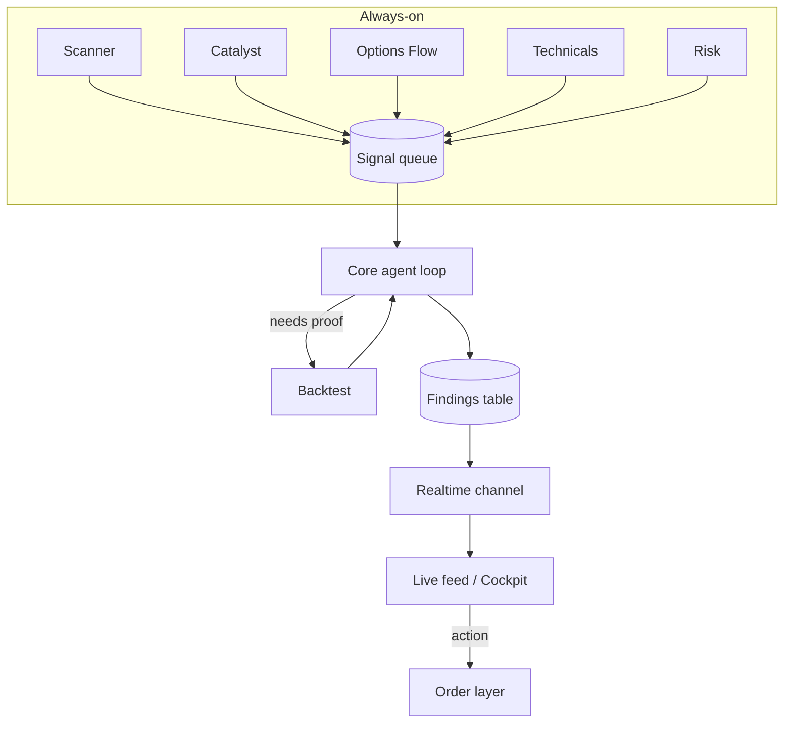

# Realtime Data Flow

How a finding travels from an engine to your screen — the loop that makes
[[DSH Sentinel]] feel alive.

## The pieces

| Layer | Job | Candidate tech |
|-------|-----|----------------|
| **Engines** | Scheduled jobs that scan and emit raw signals | `pg_cron` + edge functions, or a worker/queue |
| **Signal queue** | Buffers signals for the core to reason over | a DB table or a queue |
| **Core agent loop** | LLM reasons over signals, scores, decides | Claude via the app's AI backend |
| **Findings table** | Durable record of everything surfaced | Postgres (Supabase) |
| **Realtime channel** | Pushes new rows to every open client | Supabase Realtime / websockets |
| **Live feed** | Renders findings as they arrive | the [[Conversational Cockpit]] front end |

> [!tip] Why this is the whole trick
> The prototype (`dsh-living-bot.html`) *fakes* this loop with timers. Swap the
> timers for real engines + a realtime channel and the same UI becomes real.

## Notes on cadence

Each engine sets its own loop — see the [[Engines.base|registry]]. [[Risk]] runs
fastest (5s) and jumps the queue; [[Backtest]] runs slowest (on demand) because
it replays years of history.

## Related

- [[DSH Sentinel]] · [[Live Trading Blueprint]]
- [[Architecture.canvas|System canvas]]
